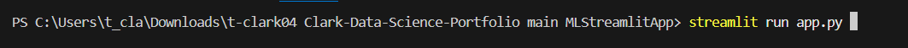
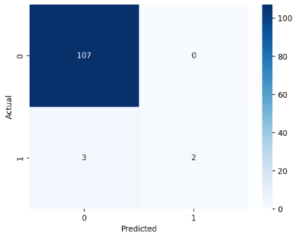
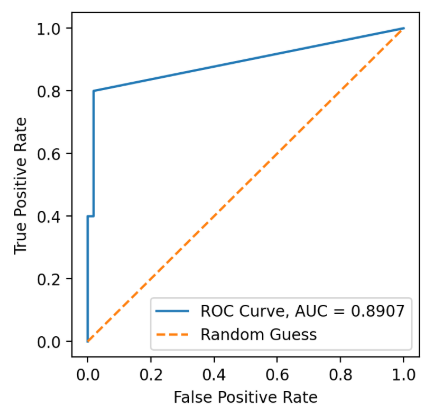

# Machine Learning Streamlit App 🤖🏀

## Overview
In this project, I have created an interactive Streamlit application that allows users to make predictions on binary target variables and evaluate several machine learning classification models -- namely logistic regression, decision trees, and k-nearest neighbors.

Powered by the Python library "scikit-learn", my app provides the user with two possible paths. They can either upload their own dataset or play around with the sample NBA data I have provided. In either case, the user's job is to:
1. Choose specific values for each of the predictors, as well as the type of classification model they'd like to use for prediction.
2. Tune the mode's hyperparameters, or allow the app to tune the hyperparameters for them.
3. Observe the outputted probability given the selected values of the predictor variables.
4. Evaluate the model's predictive power based on the displayed model metrics and visualizations.

Machine learning is the future! Try out the app for yourself, and see how easy yet powerful machine learning can be!

Thank you very much for checking out my project, and happy exploring! 📈

## Table of Contents

- [Overview](https://github.com/t-clark04/Clark-Data-Science-Portfolio/tree/main/MLStreamlitApp#overview)
- [Running the App](https://github.com/t-clark04/Clark-Data-Science-Portfolio/tree/main/MLStreamlitApp#running-the-app-)
- [Data](https://github.com/t-clark04/Clark-Data-Science-Portfolio/tree/main/MLStreamlitApp#data-%EF%B8%8F)
- [What is Machine Learning?](https://github.com/t-clark04/Clark-Data-Science-Portfolio/tree/main/MLStreamlitApp#what-is-machine-learning-)
- [Featured Models](https://github.com/t-clark04/Clark-Data-Science-Portfolio/tree/main/MLStreamlitApp#featured-models-%EF%B8%8F)
- [Featured Visuals](https://github.com/t-clark04/Clark-Data-Science-Portfolio/tree/main/MLStreamlitApp#featured-visuals-)
- [References](https://github.com/t-clark04/Clark-Data-Science-Portfolio/tree/main/MLStreamlitApp#references-)

## Running the App ✅
As with most things in life, there's an easy way and a hard way to run the app.

### Easy Way
Simply click [here](https://clark-machine-learning.streamlit.app/). This link should bring up the deployed version of the app on the Streamlit website. No further steps necessary -- just choose your path and start exploring! The only potential downside of this method is that you won't be able to see the underlying Python code if you so desire.

### Hard Way
For the hard way, you'll need to start by downloading the "MLStreamlitApp" folder from my data science portfolio repository. To do that, first go to [this link](https://download-directory.github.io/). It will open up a page that looks like this:

Paste the following link into the box in the center of the page and hit enter on the keyboard: https://github.com/t-clark04/Clark-Data-Science-Portfolio/tree/main/MLStreamlitApp.

The project files have now been downloaded to your computer as a zip file. Locate the zip file in your Downloads folder, and extract the contents.

Now, open up ``app.py`` in your favorite IDE (mine is VSCode!), head over to the terminal, and use the ls and cd commands to navigate your current directory to the "Clark-Data-Science-Portfolio main MLStreamlitApp" folder on your computer. More specifically, to enter an existing folder in your current working directory, enter "cd folder_name". To exit the folder, enter "cd ..". And to view the contents of your current folder, enter "ls".

Once you're in the correct folder, run the following prompt in the command line:

This will open up the Streamlit app in a new browser window. Time to explore!

Note: The app.py script uses the following Python libraries: ``streamlit`` (version 1.37.1), ``pandas`` (version 2.2.3), ``seaborn`` (version 0.13.2), ``matplotlib`` (version 3.10.1), ``scikit_learn`` (version 1.6.1) and ``pathlib``. If you have never used these libraries before or if they are not contained within your Python Standard Library, you may need to install them before you can run the terminal command. To do so, just hop over to the terminal in your IDE, and type: ``pip install package-name``. For example, to install pandas, just enter ``pip install pandas`` in the terminal and hit enter. Once all of these dependencies are installed, you should be good to go!

## Data 🗄️
- The underlying data for the NBA All-Star path has been adapted from a larger Kaggle dataset linked [here](https://www.kaggle.com/datasets/vivovinco/2023-2024-nba-player-stats?resource=download&select=2023-2024+NBA+Player+Stats+-+Regular.csv).
- The full dataset contains over 500 observations of NBA player statistics for the 2023-24 season across 30 different variables, though this project only utilized Rank, Player Name, Position, Points per Game, Assists per Game, and Rebounds per Game.
- Thank you to Vivo Vinco and Basketball Reference for the use of this informative dataset!

## What is Machine Learning? 🤖
- Luis Serrano, author of *Grokking Machine Learning*, defines machine learning as "common sense, except done by computer." [^1] In essence, we prompt machines to learn from experience (i.e. data) in order to make predictions about the future.
- In our case of *supervised* machine learning, this means that we feed data with a target variable and one or more predictor variables into a machine learning algorithm, and it builds a model to predict that target variable based on the other featuers. 
- My app focuses specifically on the prediction of *binary* target variables (like Yes/No, True/False, or 1/0). Since binary variables fall under the umbrella of categorical variables, all three of the machine learning models in the app are more precisely referred to as *classification* models. 

## Featured Models 🖥️
My Streamlit app allows the user to utilize three different machine learning classification models. These include logistic regression, decision trees, and k-nearest neighbors.

- Logistic Regression finds the optimal linear combination of the feature variables to predict the binary variable of interest, and uses the Sigmoid function to turn that prediction into a probability.
- Decision trees use a series of nested questions in an upside-down tree-like structure to arrive at the prediction of the target variable using the other features in the dataset.
- K-nearest neighbors uses the "majority vote" of the *k-nearest neighbors* to a given datapoint to determine the value of the predicted target variable at that point.

## Model Hyperparameters 🔧
Each of the three models depend on a different set of hyperparameters for tuning the model to the user's liking and controlling for overfitting.

For logistic regression:
- The tuning of the model mostly depends on whether the features are standardized (scaled) or not.
- ``penalty`` can also be used to control the weighting of the coefficients, but it is kept at the default value of 'l2' in this app.

For decision trees:
- ``criterion`` specifies the metric used for finding the optimal "question" to ask at each decision node.
- ``max_depth`` defines the maximum number of levels in the decision tree before being cut off.
- ``min_samples_split`` specifies the minimum number of samples needed for a node to be split further.
- ``min_samples_leaf`` gives the minimum number of samples required in the resulting leaves for a node to be split further.

For k-nearest neighbors:
- Features are allowed to be scaled or unscaled according to the user's preference.
- ``n_neighbors`` defines the number of nearest neighbors to use as the "voting populace".
- ``metric`` specifies the method for calculating the distance to the closest datapoints.

## Featured Visuals 📊
My machine learning app utilizes two different kinds of visuals for displaying the evaluation metrics of a given classification model. These include the confusion matrix and the ROC Curve.

Confusion matrices:
- Show the number of true positives, true negatives, false positives, and false negatives in the testing dataset.
  - True positives (TP) are the datapoints correctly predicted to be 1. True negatives (TN) are the datapoints correctly predicted to be 0.
  - False positives (FP) are the datapoints incorrectly predicted to be 1. False negatives (FN) are those incorrectly predicted to be 0.
- Can easily be used to calculate evaluation metrics, since precision = $\frac{TP}{(TP + FP)}$ and recall = $\frac{TP}{(TP _ FN)}$.
  

The ROC (Receiver Operating Characteristic) Curve:
- Plots the True Positive Rate (TPR) against the False Positive Rate (TNR).
- Can be used to visualize the optimal probability threshold for classifying datapoints as a 0 or a 1, though that threshold is optimized automatically in this app.
- Determines the AUC, or Area Under Curve, for the model, which gives us a good idea of the model's general performance across thresholds (0.8 is typically the benchmark for a good model).

## References 📚
For more information on supervised machine learning, I invite you to check out Luis G. Serrano's book, *Grokking Machine Learning*, as most of my general knowledge on the topic has come from that text.

Furthermore, the idea for the general layout and probability outputs of this Streamlit app were inspired by the LinkedIn user prediction app linked [here](https://chandinir-linkedin-prediction-app-final-project-app-tjatqd.streamlit.app/). So, thank you to Chandini Ramesh for inspiring this app in many ways! 

Finally, as stated above, the data for this project has been adapted from the work of Vivo Vinco and Basketball Reference, whom I also thank for making the sample data portion of this app possible. You can find the original dataset linked [here](https://www.kaggle.com/datasets/vivovinco/2023-2024-nba-player-stats?resource=download&select=2023-2024+NBA+Player+Stats+-+Regular.csv).

[^1]: Serrano, Luis G. *Grokking Machine Learning*. Manning, 2021.
