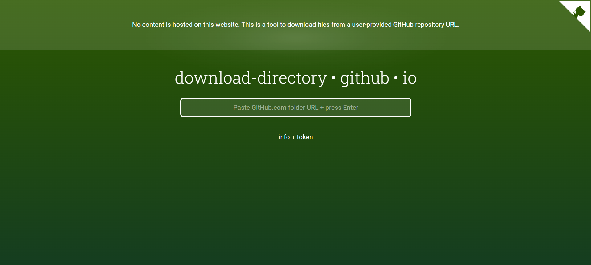

# Machine Learning Streamlit App 🤖🏀

## Overview 📊
In this project, I have created an interactive Streamlit application that allows users to make predictions on binary target variables and evaluate several machine learning classification models, namely logistic regression, decision trees, and k-nearest neighbors.

Powered by the Python library "sklearn", my app provides the user with two possible paths -- they can either upload their own dataset or play around with the sample NBA data I have provided. In either case, the user's job is to:
1. Choose specific values for each of the predictors, as well as the type of classification model they'd like to use for prediction.
2. Tune the mode's hyperparameters, or allow the app to tune the hyperparameters for them.
3. Observe the outputted probability given the selected values of the predictor variables.
4. Evaluate the model's predictive power based on the displayed model metrics and visualizations.

Machine learning is the future! Try out the app for yourself, and see how easy yet powerful machine learning can be!

Thank you very much for checking out my project, and happy exploring! 📈

## Table of Contents

- [Overview](https://github.com/t-clark04/Clark-Data-Science-Portfolio/tree/main/TidyData-Project#overview-)
- [Getting Started](https://github.com/t-clark04/Clark-Data-Science-Portfolio/tree/main/TidyData-Project#getting-started-)
- [Data](https://github.com/t-clark04/Clark-Data-Science-Portfolio/tree/main/TidyData-Project#data-%EF%B8%8F)
- [Project Insights](https://github.com/t-clark04/Clark-Data-Science-Portfolio/tree/main/TidyData-Project#project-insights-)
- [References](https://github.com/t-clark04/Clark-Data-Science-Portfolio/tree/main/TidyData-Project#references-)

## Running the App ✅
As with most things in life, there's an easy way and a hard way to run the app.

To run it the easy way, simply click [here](https://clark-machine-learning.streamlit.app/). This link should bring up the deployed version of the app on the Streamlit website. No further steps necessary -- just choose your path and start exploring! The only downside of the easy way is that you won't be able to see the underlying Python code.

For the hard way, you'll need to start by downloading the "MLStreamlitApp" folder from my data science portfolio repository. To do that, first go to [this link](https://download-directory.github.io/). It will open up a page that looks like this:

Paste the following link into the box in the center of the page and hit enter on the keyboard: https://github.com/t-clark04/Clark-Data-Science-Portfolio/tree/main/MLStreamlitApp.

The project files have now been downloaded to your computer as a zip file. Locate the zip file in your Downloads folder:

### Easy Way

you first need to download the "TidyData-Project" folder from my data science portfolio repository. To do that, first go to [this link](https://download-directory.github.io/). It will open up this page:

Paste the following link into the box in the center of the page and hit enter on the keyboard: https://github.com/t-clark04/Clark-Data-Science-Portfolio/tree/main/TidyData-Project.

The project files have now been downloaded to your computer as a zip file. Locate the zip file in your Downloads folder:

Right-click on the file (or double-click on a Mac) and extract the contents. Now, open up ``main.ipynb`` in your favorite IDE (mine is VSCode!), and run the whole notebook yourself!

Note: This Jupyter notebook uses the following Python libraries: ``pandas``, ``warnings``, ``seaborn``, and ``matplotlib``. If you have never used these libraries before or if they are not contained within your Python Standard Library, you may need to install them before you can run the code in the notebook. To do so, just hop over to the terminal in your IDE, and type: ``pip install package-name``. For example, to install pandas, just enter ``pip install pandas`` in the terminal and hit enter. Once all of these dependencies are installed, you should be good to go!

Luis Serrano, author of *Grokking Machine Learning*, defines machine learning as "common sense, except done by computer." [^1] In our case of *supervised* machine learning, this means that we feed data with a target variable and one or more predictor variables to a machine learning algorithm, and it builds a model to predict that target variable when it is absent from the data. My app focuses specifically on the prediction of *binary* target variables (like Yes/No, True/False, or 1/0). 

## Getting Started ✅
To run the Jupyter notebook yourself, you first need to download the "TidyData-Project" folder from my data science portfolio repository. To do that, first go to [this link](https://download-directory.github.io/). It will open up a page that looks like this:

Paste the following link into the box in the center of the page and hit enter on the keyboard: https://github.com/t-clark04/Clark-Data-Science-Portfolio/tree/main/TidyData-Project.

The project files have now been downloaded to your computer as a zip file. Locate the zip file in your Downloads folder:

Right-click on the file (or double-click on a Mac) and extract the contents. Now, open up ``main.ipynb`` in your favorite IDE (mine is VSCode!), and run the whole notebook yourself!

Note: This Jupyter notebook uses the following Python libraries: ``pandas``, ``warnings``, ``seaborn``, and ``matplotlib``. If you have never used these libraries before or if they are not contained within your Python Standard Library, you may need to install them before you can run the code in the notebook. To do so, just hop over to the terminal in your IDE, and type: ``pip install package-name``. For example, to install pandas, just enter ``pip install pandas`` in the terminal and hit enter. Once all of these dependencies are installed, you should be good to go!

## Data 🗄️

The messy data for this mini-project has been adapted from a dataset found at [this link](https://edjnet.github.io/OlympicsGoNUTS/2008/), so thank you to Giorgio Comai from the European Data Journalism Network for the use of his data. You can download the data directly by heading over to the data folder linked [here](https://github.com/t-clark04/Clark-Data-Science-Portfolio/tree/main/TidyData-Project/data) and downloading the file called ``olympics_08_medalists.csv``. However, if you follow the steps in the "Getting Started" section, there is no need to download the data individually or to carry out any other pre-processing steps. Once cleaned, the dataset contains 1,875 observations across 4 variables relating to the athletes who earned Olympic medals at the 2008 games in Beijing.

## Project Insights 💡

Two of the biggest insights generated by this mini-project were those uncovered through the following visualizations.

In this bar chart, we see that in every medal category (i.e. gold, silver, and bronze), male athletes earned a greater number of medals than female athletes at the 2008 Summer Olympics. However, as we discovered over the course of the project, this isn't because of a difference in athletic ability. Rather, it's likely due to the fact that Olympic sports often have more male events, which is a long-term effect of some sports being historically male-dominated.

These pie charts show us the sports that were awarded the most medals at the 2008 Olympics. Somewhat unsurprisingly, we find that the sports with either the most events (like athletics and swimming) or the most athletes on the field at a time (like association football and field hockey) were awarded the most medals. However, something to explore a bit further after seeing these graphs might be the correlation of Olympic sport age (i.e. how long they have been included in the Olympics) with number of medals awarded, since athletics and swimming are also among the oldest Olympic sports. Perhaps, this could be a topic for a future mini-project! 🤔

## References 📚

For more information on Hadley Wickham's concept of "tidy data", check out his original article in the Journal of Statistical Software linked [here](https://www.jstatsoft.org/article/view/v059i10).

While you're at it, feel free to also take a look at the "Pandas Cheat Sheet" [here](https://pandas.pydata.org/Pandas_Cheat_Sheet.pdf). It contains descriptions and examples of many of the functions and methods I used in this project.

Finally, as stated above, the data for this project has been adapted from the work of Giorgio Comai with the European Data Journalism Network. You can find the original source linked [here](https://edjnet.github.io/OlympicsGoNUTS/2008/).

[^1]: Serrano, Luis G. *Grokking Machine Learning*. Manning, 2021.
