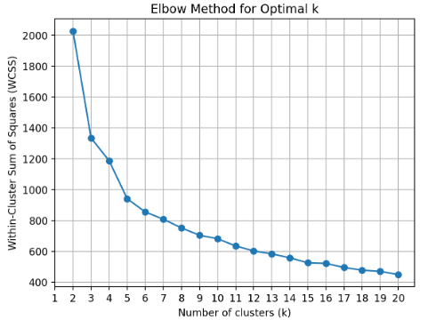
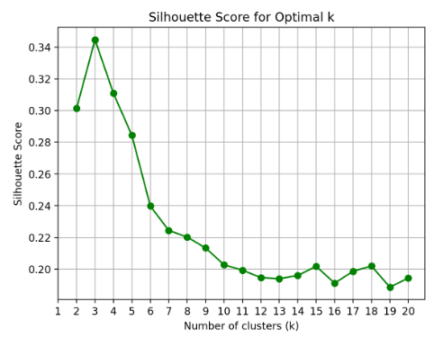
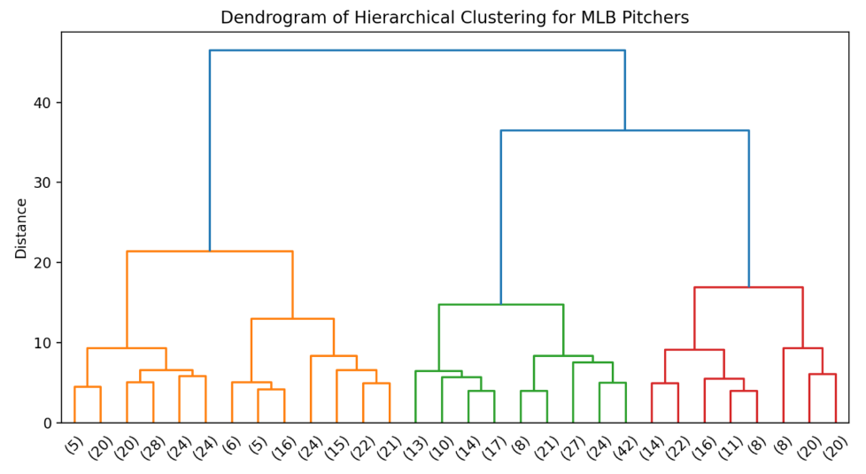

# Unsupervised Machine Learning App ⚾📈

## Overview
For this project, I have built an interactive Streamlit application that allows users to explore the two main uses of unsupervised machine learning: clustering and dimensionality reduction!

The user can either upload their own dataset or jump into the world of *Moneyball* by exploring the pitching data I have provided. In either case, the user's job is to:
1. Select a collection of variables from the dataset to build their clusters.
2. Pick the particular clustering model to use and tune the hyperparameters to start.
3. Choose a dimensionality reduction algorithm for visualizing the clusters in the xy-plane.
4. Customize the future plot by selecting which variables to display when hovering over a datapoint. Then, hit "Run!".
5. Observe the model feedback, re-adjust hyperparameters if necessary, and explore the clustered data!

Unsupervised machine learning finds meaning in "meaningless" data. It's as close to magic as it gets, so try it out for yourself! Who knows what you'll uncover!

Thank you for checking out my project!

## Table of Contents

- [Overview](https://github.com/t-clark04/Clark-Data-Science-Portfolio/edit/main/MLUnsupervisedApp/README.md#overview)
- [Running the App](https://github.com/t-clark04/Clark-Data-Science-Portfolio/edit/main/MLUnsupervisedApp/README.md#running-the-app-)
- [Data](https://github.com/t-clark04/Clark-Data-Science-Portfolio/edit/main/MLUnsupervisedApp/README.md#data-%EF%B8%8F)
- [What is Machine Learning?](https://github.com/t-clark04/Clark-Data-Science-Portfolio/edit/main/MLUnsupervisedApp/README.md#what-is-machine-learning-)
- [Featured Models](https://github.com/t-clark04/Clark-Data-Science-Portfolio/edit/main/MLUnsupervisedApp/README.md#featured-models-%EF%B8%8F)
- [Model Hyperparameters](https://github.com/t-clark04/Clark-Data-Science-Portfolio/edit/main/MLUnsupervisedApp/README.md#model-hyperparameters-)
- [Featured Visualizations](https://github.com/t-clark04/Clark-Data-Science-Portfolio/edit/main/MLUnsupervisedApp/README.md#featured-visualizations-)
- [References](https://github.com/t-clark04/Clark-Data-Science-Portfolio/edit/main/MLUnsupervisedApp/README.md#references-)

## Running the App ✅
This application is deployed on the Streamlit Community Cloud, which means there's an easy way and a hard way to run the app.

### The "Easy" Way:
Simply click [here](https://clark-unsupervised.streamlit.app). This link should bring up the published version of the app on the Streamlit website. No further steps necessary -- just choose your path and start exploring! If you wish to see the underlying Python code, however, you'll have to run it the "hard" way...

### The "Hard" Way:
You'll start by downloading the "MLUnsupervisedApp" folder from my data science portfolio repository. To do that, first go to [this link](https://download-directory.github.io/). It will open up a page that looks like this:

Paste the following link into the box in the center of the page and hit enter on the keyboard: https://github.com/t-clark04/Clark-Data-Science-Portfolio/tree/main/MLUnsupervisedApp.

The project files have now been downloaded to your computer as a zip file. Locate the zip file in your Downloads folder, and extract the contents.

Now, open up ``app.py`` in your favorite IDE (mine is VSCode!), head over to the terminal, and use the ls and cd commands to navigate your current directory to the "Clark-Data-Science-Portfolio main MLUnsupervisedApp" folder on your computer. More specifically, to enter an existing folder in your current working directory, enter "cd folder_name". To exit the folder, enter "cd ..". And to view the contents of your current folder, enter "ls".

Once you're in the correct folder, run the following prompt in the command line:

This will open up the Streamlit app in a new browser window. Happy exploring!

Note: The app.py script uses the following Python libraries: ``streamlit`` (version 1.37.1), ``pandas`` (version 2.2.3), ``seaborn`` (version 0.13.2), ``matplotlib`` (version 3.10.1), ``scikit_learn`` (version 1.6.1), ``plotly`` (version 5.24.1), ``scipy`` (version 1.15.2), and ``pathlib``. If you have never used these libraries before or if they are not contained within your Python Standard Library, you may need to install them before you can run the terminal command. To do so, just hop over to the terminal in your IDE, and type: ``pip install package-name``. For example, to install pandas, just enter ``pip install pandas`` in the terminal and hit enter. Once all of these dependencies are installed, you should be good to go!

## Data 🗄️
- The 2024 MLB pitching dataset and the glossary used for the sabermetrics portion of the app come from Baseball-Reference.com.
- To check out the full dataset, head over to the website linked [here](https://www.baseball-reference.com/leagues/majors/2024-standard-pitching.shtml).
- I express my most sincere gratitude to Baseball Reference for the use of this data and for helping this awesome app come to fruition!

## What is Machine Learning? 🤖
- Luis Serrano, author of *Grokking Machine Learning*, defines machine learning as "common sense, except done by computer." [^1] In essence, we prompt machines to learn from experience (i.e. data) to help us make decisions or predict the future.
- In this project, I focus specifically on *unsupervised* machine learning, which means that the dataset we input contains no target variable. There is nothing in the dataset that we wish to predict based on the other features, so we are left with two main options. We can:
1. Group together similar observations ("clustering") and explore potential relationships between variables in this way.
2. Cut down the number of variables in our dataset ("dimensionality reduction") with the goal of visualizing multi-dimensional data or preparing the data for *supervised* machine learning (see [Supervised Machine Learning App 🤖🏀](https://github.com/t-clark04/Clark-Data-Science-Portfolio/tree/main/MLStreamlitApp)). 
- My app actually does both! It first clusters the given data using the selected variables and hyperparameters inputted by the user. Then, it uses dimensionality reduction to project the n-dimensional clusters into 2-D space!  

## Featured Models 🖥️
This Streamlit app utilizes four different unsupervised machine learning models -- two for clustering and two for dimensionality reduction.

Clustering models:
- **KMeans** groups data into *k* clusters by finding the location of the optimal centroid to minimize the within-cluster sum of squares (WCSS, or inertia) for each cluster.
- **Hierarchical clustering** uses a bottom-up approach to build a tree of nested clusters, combining them into larger clusters according to the linkage rule specified by the user.

Dimensionality reduction models:
- **Principal Components Analysis (PCA)** creates linear combinations of the variables in the dataset and weights them according to their respective variances. This allows us to explain as much variance in the data as we can with as few variables as possible. In our case, we take the first two principal components (since they explain the most variance) and use those to graph clusters in the xy-plane.
- **T-distributed Stochastic Neighbor Embedding (t-SNE)** is designed specifically for visualizing high-dimensional data, and it essentially uses joint probability distributions to group together similar data points in 2- or 3-dimensional space. It is the recommended method for our purposes, though it will likely take a few more seconds to produce the graph.

## Model Hyperparameters 🔧
In this app, only the two clustering models require user-inputted hyperparameters.

For KMeans Clustering:
- ``k`` sets the number of clusters to group the data into. It is recommended that the user optimize this number according to the output given in the elbow and silhouette score plots.

For Hierarchical Clustering:
- ``k`` again denotes the number of clusters. It should be adjusted for optimization by the user according to the information given in the dendrogram.
- ``linkage`` sets the criterion to be minimized when merging clusters together. Scikit-learn sets the default to 'ward', which minimizes the within-cluster variance of newly-created clusters. Click [here](https://bookdown.org/content/f097ddae-23f5-4b2d-b360-ad412a6ca36a/chapter-2.-hierarchical-clustering.html#wards-method) for more information on the various linkage metrics, or see the Scikit-learn reference page linked [here](https://scikit-learn.org/stable/modules/generated/sklearn.cluster.AgglomerativeClustering.html).

## Featured Visualizations 📊
My app relays model feedback to the user through three different kinds of visuals. These include the elbow plot, the silhouette score plot, and the dendrogram.

Elbow plots:
- Display the within-cluster variance for KMeans models built with various values of *k*. 
- Allow the user to find the optimal number of clusters by locating the value of *k* after which the slope sharply flattens out (like an elbow shape).
  

Silhouette Score Plots:
- Display the silhouette score, which measures the average similarity of data points within a cluster, at different values of *k*.
- Provide another source of guidance for choosing the optimal number of clusters by locating the *k* value that maximizes the silhouette score.

Dendrograms:
- Help the user visualize the bottom-up clustering process carried out by the hierarchical clustering algorithm.
- Allow the user to cut the tree at a desired height (i.e. cluster distance) upon visual inspection of the dendrogram, thus giving them an optimal value for *k*.

## References 📚
For more information on unsupervised machine learning, I invite you to check out the overview provided in Luis G. Serrano's book, *Grokking Machine Learning*, as most of my general knowledge on machine learning has come from that text.

I also invite you to check out the Scikit-Learn API linked [here](https://scikit-learn.org/stable/api/index.html), as it contains information on all of the machine learning models and hyperparameters used in this app. 

Finally, as stated above, the underlying data and the glossary for the sabermetrics portion of this project comes from Baseball-Reference.com. So be sure to check out the full dataset on their website linked [here](https://www.baseball-reference.com/leagues/majors/2024-standard-pitching.shtml). Thank you to Baseball Reference for making this app possible!

[^1]: Serrano, Luis G. *Grokking Machine Learning*. Manning, 2021.
