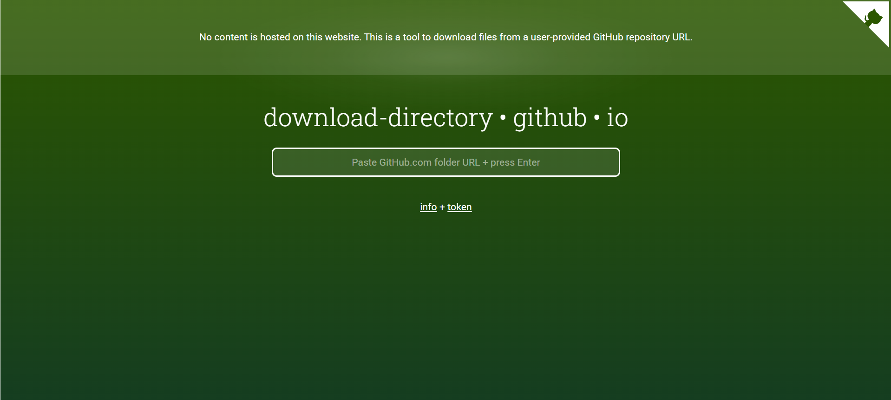

# Unsupervised Machine Learning App ⚾📈

## Overview
For this project, I have built an interactive Streamlit application that allows users to explore the two main uses of unsupervised machine learning: clustering and dimensionality reduction!

The user can either upload their own dataset or jump into the world of *Moneyball* by exploring the pitching data I have provided. In either case, the user's job is to:
1. Select a collection of variables from the dataset to build their clusters.
2. Pick the clustering model to use -- either KMeans or Hierarchical -- and tune the hyperparameters to start.
3. Choose a dimensionality reduction algorithm for visualizing the clusters in the xy-plane.
4. Customize the future plot by selecting which variables to display when hovering over a datapoint. Then, hit "Run!".
5. Observe the model feedback, re-adjust hyperparameters if necessary, and explore the clustered data!

Unsupervised machine learning finds meaning in meaningless data. It's as close to magic as it gets, so try it out yourself! Who knows what unexpected insights you'll uncover!

Thank you for checking out my project!

## Table of Contents

- [Overview]()
- [Running the App]()
- [Data]()
- [What is Machine Learning?]()
- [Featured Models]()
- [Model Hyperparameters]()
- [Featured Visualizations]()
- [References]()

## Running the App ✅
This application is deployed on the Streamlit Community Cloud, which means there's an easy way and a hard way to run the app.

### The "Easy" Way:
Simply click [here](https://clark-unsupervised.streamlit.app). This link should bring up the published version of the app on the Streamlit website. No further steps necessary -- just choose your path and start exploring! If you wish to see the underlying Python code, however, you'll have to run it the "hard" way...

### The "Hard" Way:
You'll have to start by downloading the "MLUnsupervisedApp" folder from my data science portfolio repository. To do that, first go to [this link](https://download-directory.github.io/). It will open up a page that looks like this:

Paste the following link into the box in the center of the page and hit enter on the keyboard: https://github.com/t-clark04/Clark-Data-Science-Portfolio/tree/main/MLUnsupervisedApp.

The project files have now been downloaded to your computer as a zip file. Locate the zip file in your Downloads folder, and extract the contents.

Now, open up ``app.py`` in your favorite IDE (mine is VSCode!), head over to the terminal, and use the ls and cd commands to navigate your current directory to the "Clark-Data-Science-Portfolio main MLUnsupervisedApp" folder on your computer. More specifically, to enter an existing folder in your current working directory, enter "cd folder_name". To exit the folder, enter "cd ..". And to view the contents of your current folder, enter "ls".

Once you're in the correct folder, run the following prompt in the command line:

This will open up the Streamlit app in a new browser window. Happy exploring!

Note: The app.py script uses the following Python libraries: ``streamlit`` (version 1.37.1), ``pandas`` (version 2.2.3), ``seaborn`` (version 0.13.2), ``matplotlib`` (version 3.10.1), ``scikit_learn`` (version 1.6.1), ``plotly`` (version 5.24.1), ``scipy`` (version 1.15.2), and ``pathlib``. If you have never used these libraries before or if they are not contained within your Python Standard Library, you may need to install them before you can run the terminal command. To do so, just hop over to the terminal in your IDE, and type: ``pip install package-name``. For example, to install pandas, just enter ``pip install pandas`` in the terminal and hit enter. Once all of these dependencies are installed, you should be good to go!

## Data 🗄️
- The 2024 MLB pitching dataset and the glossary used for the sabermetrics portion of the app come from Baseball-Reference.com.
- To check out the full dataset, head over to the website linked [here](https://www.baseball-reference.com/leagues/majors/2024-standard-pitching.shtml).
- I express my most sincere gratitude to Baseball Reference for the use of this information and for making this app possible!

## What is Machine Learning? 🤖
- Luis Serrano, author of *Grokking Machine Learning*, defines machine learning as "common sense, except done by computer." [^1] In essence, we prompt machines to learn from experience (i.e. data) to help us make decisions or predict the future.
- In this project, I focus specifically on *unsupervised* machine learning, which means that the dataset we input contains no target variable. There is nothing in the dataset that we wish to predict based on the other features, so we are left with two main options. We can:
1. Group together similar observations ("clustering") and explore potential relationships between variables in this way.
2. Cut down the number of variables in our dataset ("dimensionality reduction") with the goal of visualizing multi-dimensional data or preparing the data for *supervised* machine learning (see [Supervised Machine Learning App 🤖🏀](https://github.com/t-clark04/Clark-Data-Science-Portfolio/tree/main/MLStreamlitApp)). 
- My app actually does both! It first clusters the given data using the selected variables and hyperparameters inputted by the user. Then, it uses dimensionality reduction to project the n-dimensional clusters into 2-D space and allow the user to gather insights.  

## Featured Models 🖥️
My Streamlit app allows the user to utilize three different machine learning classification models. These include logistic regression, decision trees, and k-nearest neighbors.

- Logistic Regression finds the optimal linear combination of the feature variables to predict the binary variable of interest, and it uses the Sigmoid function to turn that prediction into a probability.
- Decision trees use a series of nested questions in an upside-down tree-like structure to arrive at the prediction of the target variable using the other features in the dataset.
- K-nearest neighbors uses the "majority vote" of the *k-nearest neighbors* to a given datapoint to determine the value of the predicted target variable at that point.

## Model Hyperparameters 🔧
Each of the three models depends on a different set of hyperparameters for tuning the model to the user's liking and controlling for overfitting.

For logistic regression:
- The tuning of the model mostly depends on whether the features are standardized (scaled) or not.
- ``penalty`` can also be used to control the weighting of the coefficients, but it is kept at the default value of 'l2' in this app.

For decision trees:
- ``criterion`` specifies the algorithm used for finding the optimal "question" to ask at each decision node.
- ``max_depth`` defines the maximum number of levels in the decision tree before being cut off.
- ``min_samples_split`` specifies the minimum number of samples required at a node for it to be split further.
- ``min_samples_leaf`` gives the minimum number of samples required in the resulting leaves for a node to be split further.

For k-nearest neighbors:
- Features are allowed to be scaled or unscaled according to the user's preference.
- ``n_neighbors`` represents our 'k' value and corresponds to the number of nearest neighbors to use as the "voting populace".
- ``metric`` specifies the method for calculating the distance to the closest datapoints. Click [here](https://www.kdnuggets.com/2023/03/distance-metrics-euclidean-manhattan-minkowski-oh.html) for more information on the various distance metrics.

## Featured Visualizations 📊
My machine learning app utilizes two different kinds of visuals for displaying the evaluation metrics of a given classification model. These include the confusion matrix and the ROC Curve.

Confusion matrices:
- Show the number of true positives, true negatives, false positives, and false negatives in the testing dataset.
  - True positives (TP) are the datapoints correctly predicted to be 1. True negatives (TN) are the datapoints correctly predicted to be 0.
  - False positives (FP) are the datapoints incorrectly predicted to be 1. False negatives (FN) are those incorrectly predicted to be 0.
- Can easily be used to calculate key evaluation metrics like precision and recall, since precision = $\frac{TP}{(TP + FP)}$ and recall = $\frac{TP}{(TP + FN)}$.
- Give us a quick idea of the model's predictive success with the training set.
  

The ROC (Receiver Operating Characteristic) Curve:
- Plots the True Positive Rate (TPR) against the False Positive Rate (FPR).
- Can be used to visualize the optimal probability threshold for classifying datapoints as a 0 or a 1, though that threshold is optimized automatically in this app.
- Determines the AUC, or Area Under Curve, for the model, which gives us a good idea of the model's general performance across thresholds (0.8 is typically the benchmark for a good model).

## References 📚
For more information on supervised machine learning, I invite you to check out Luis G. Serrano's book, *Grokking Machine Learning*, as most of my general knowledge on the topic has come from that text.

Furthermore, the idea for the general layout and probability outputs of this Streamlit app were inspired by the LinkedIn user prediction app linked [here](https://chandinir-linkedin-prediction-app-final-project-app-tjatqd.streamlit.app/). So, thank you to Chandini Ramesh for inspiring this app in many ways! 

Finally, as stated above, the data for this project has been adapted from the work of Vivo Vinco and Basketball Reference, whom I also thank for making the sample data portion of this app possible. You can find the original dataset linked [here](https://www.kaggle.com/datasets/vivovinco/2023-2024-nba-player-stats?resource=download&select=2023-2024+NBA+Player+Stats+-+Regular.csv).

[^1]: Serrano, Luis G. *Grokking Machine Learning*. Manning, 2021.
