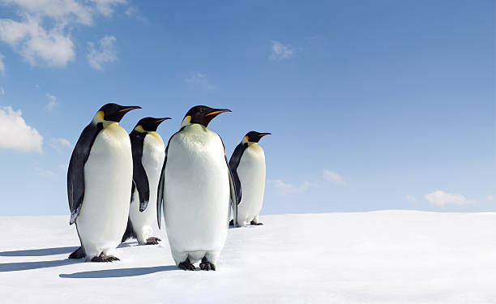
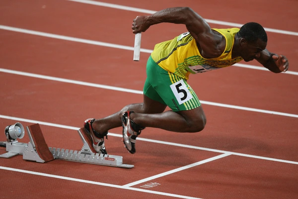
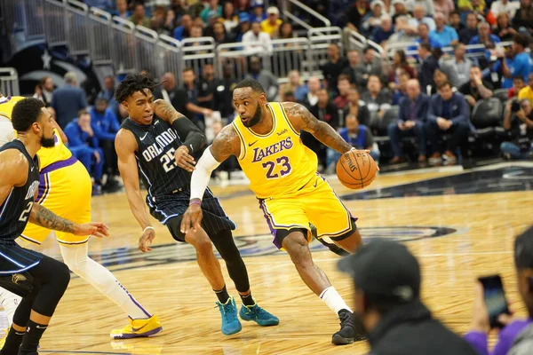
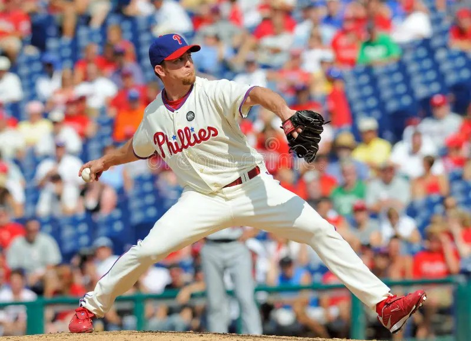

# Data Science Portfolio - Tommy Clark

This repository contains all of my data science-related projects completed over the course of the semester in MDSC 20009: Introduction to Data Science.📊 Projects are grouped either by their implemented techniques (i.e. machine learning, LLMs, etc.) or according to their corresponding step in the data science workflow (i.e. EDA, data cleaning, visualization, etc.). 📈 Links to project repositories will be provided to make it easier to locate code of interest. 🔗 The portfolio will be updated on a regular basis.

## Basic EDA
 **[Palmer's Penguins Streamlit App 🐧❄️](https://github.com/t-clark04/Clark-Data-Science-Portfolio/tree/main/basic-streamlit-app)**

Showcases my proficiency with the Streamlit library, as well as my skills in working with pandas DataFrames. Allows users to filter and explore the Palmer's Penguins dataset, which contains measurements on three different species of penguins living on the Palmer Archipelago in Antarctica. Click [here](https://clark-penguins.streamlit.app) to get started, or navigate over to the [basic-streamlit-app](https://github.com/t-clark04/Clark-Data-Science-Portfolio/tree/main/basic-streamlit-app) folder for more information! 

#

## Data Cleaning and Visualization
 **[Tidy Data Project 🧹 ✨](https://github.com/t-clark04/Clark-Data-Science-Portfolio/tree/main/TidyData-Project)**

Demonstrates my expertise in data cleaning and visualization using Python libraries like ``pandas``, ``seaborn``, and ``matplotlib``. Starting with a "messy" dataset on the 2008 Olympic medalists, I first re-format the data into a ["tidy"](https://www.jstatsoft.org/article/view/v059i10) data frame and then explore relationships in variables (like `Gender` and `Sport`) through pivot tables and visualizations. Click [here](https://github.com/t-clark04/Clark-Data-Science-Portfolio/tree/main/TidyData-Project) to check it out for yourself! 

#

## Machine Learning
 **[Supervised Machine Learning App 🤖🏀](https://github.com/t-clark04/Clark-Data-Science-Portfolio/tree/main/MLStreamlitApp)**

Displays my ability to develop and deploy interactive web applications with ``streamlit`` and build machine learning models with ``scikit-learn``. Allows the user to explore various classification models, tune hyperparameters, make predictions, and evaluate predictive power through user-uploaded data or a provided NBA dataset. Head over to [MLSStreamlitApp](https://github.com/t-clark04/Clark-Data-Science-Portfolio/tree/main/MLStreamlitApp) for the full app description, or click [here](https://clark-machine-learning.streamlit.app/) to check out the deployed app now!

**Machine Learning Models**: Logistic Regression, Decision Tree, K-Nearest Neighbors

 

 **[Unsupervised Machine Learning App ⚾📈](https://github.com/t-clark04/Clark-Data-Science-Portfolio/tree/main/MLUnsupervisedApp)**

Showcases my mastery of ``streamlit`` web applications, as well as my understanding of both clustering and dimensionality reduction in ``scikit-learn``. Prompts users to select variables for clustering, choose their desired unsupervised learning models, tune hyperparameters, customize output, and explore their interactive ``plotly`` scatterplot. Explore the app right now by clicking [here](https://clark-unsupervised.streamlit.app/), or navigate over to [MLUnsupervisedApp](https://github.com/t-clark04/Clark-Data-Science-Portfolio/tree/main/MLUnsupervisedApp) for more info!

#

