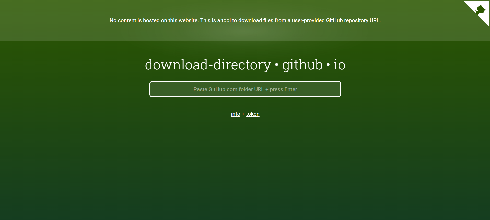
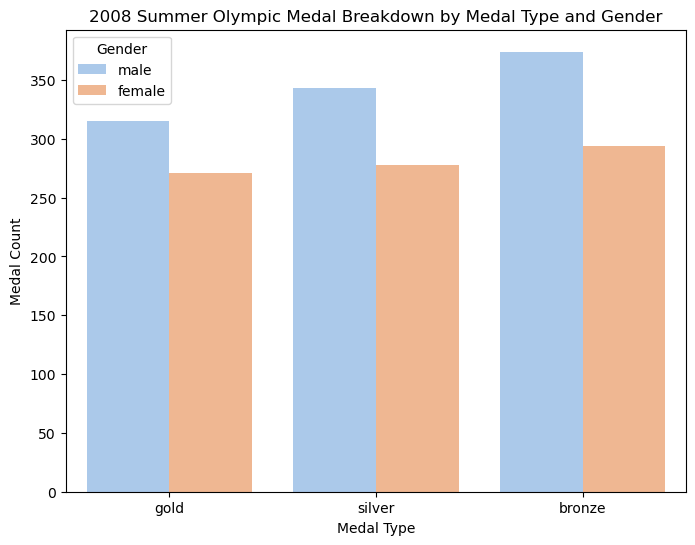
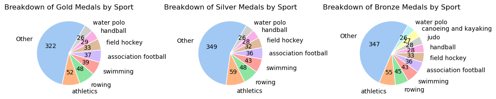

# Tidy Data Project 🧹 ✨

## Overview 📊
In this "tidy data" mini-project, I showcase my skills in data cleaning and visualization in Python, starting with a "messy" dataset on the medalists at the 2008 Summer Olympics in Beijing 🥇. With the help of methods like ``pd.melt()``, ``dropna()``, and ``str.split()``, I first transform the data according to the principles of ["tidy data"](https://www.jstatsoft.org/article/view/v059i10) put forth by New Zealand statistician Hadley Wickham. He proposed that data be formatted such that:

(1) Every variable has its own column.

(2) Every observation forms a separate row.

(3) Every distinct type of observational unit has its own separate table.

Following this universal standard for data formatting makes cleaning, modeling, and visualization much simpler, since many of the tools we use for facilitating data analysis in Python (such as those found in the [Pandas Cheat Sheet](https://pandas.pydata.org/Pandas_Cheat_Sheet.pdf)) expect data to be inputted in this format. It also cuts down the number of tools necessary to transform messy data into the tidy data we want.

After cleaning the data, I end up with a pandas DataFrame containing information on 1,875 athletes at the 2008 Olympics, namely their ``Gender``, the ``Sport`` they played, and the type of ``Medal`` they earned (i.e. gold, silver, or bronze). I then explore the relationships between these three categorical variables through pivot tables and visualizations, and I discuss some possible reasons for the patterns we discover. 

Thank you for checking out my project, and I hope you learn a thing or two about data cleaning and visualization in Python!🐍

## Table of Contents

- [Overview](https://github.com/t-clark04/Clark-Data-Science-Portfolio/tree/main/TidyData-Project#overview-)
- [Getting Started](https://github.com/t-clark04/Clark-Data-Science-Portfolio/tree/main/TidyData-Project#getting-started-)
- [Project Data](https://github.com/t-clark04/Clark-Data-Science-Portfolio/tree/main/TidyData-Project#project-data-%EF%B8%8F)
- [Project Insights](https://github.com/t-clark04/Clark-Data-Science-Portfolio/tree/main/TidyData-Project#project-insights-)
- [References](https://github.com/t-clark04/Clark-Data-Science-Portfolio/tree/main/TidyData-Project#references-)

## Getting Started ✅
To run the Jupyter notebook yourself, you first need to download the "TidyData-Project" folder from my data science portfolio repository. To do that, first go to [this link](https://download-directory.github.io/). It will open up a page that looks like this:

Paste the following link into the box in the center of the page and hit enter on the keyboard: https://github.com/t-clark04/Clark-Data-Science-Portfolio/tree/main/TidyData-Project.

The project files have now been downloaded to your computer as a zip file. Locate the zip file in your Downloads folder:

Right-click on the file (or double-click on a Mac) and extract the contents. Now, open up ``main.ipynb`` in your favorite IDE (mine is VSCode!), and run the whole notebook yourself!

Note: This Jupyter notebook uses the following Python libraries: ``pandas``, ``warnings``, ``seaborn``, and ``matplotlib``. If you have never used these libraries before or if they are not contained within your Python Standard Library, you may need to install them before you can run the notebook. To do so, just hop over to the terminal in your IDE, and type: ``pip install package-name``. For example, to install pandas, just enter ``pip install pandas`` in the terminal and hit enter. Once all of these dependencies are installed, you should be good to go!

## Project Data 🗄️

The messy data for this mini-project has been adapted from a dataset found at [this link](https://edjnet.github.io/OlympicsGoNUTS/2008/), so thank you to Giorgio Comai from the European Data Journalism Network for the use of his data. You can download the data directly by heading over to the data folder linked [here](https://github.com/t-clark04/Clark-Data-Science-Portfolio/tree/main/TidyData-Project/data) and downloading the file called ``olympics_08_medalists.csv``. However, if you follow the steps in the "Getting Started" section, there is no need to download the data individually or to carry out any other pre-processing steps. Once cleaned, the dataset contains 1,875 observations across 4 variables relating to the athletes who earned Olympic medals at the 2008 games in Beijing.

## Project Insights 💡

Two of the biggest insights generated by this mini-project were those uncovered through the following visualizations.

In this bar chart, we see that in every medal category (i.e. gold, silver, and bronze), male athletes earned a greater number of medals than female athletes at the 2008 Summer Olympics. However, as we discovered over the course of the project, this isn't because of a difference in athletic ability. Rather, it's due to the fact that Olympic sports often have more male events, which is a long-term effect of some sports being historically male-dominated.

Furthermore, these pie charts show us the sports that were awarded the most medals at the 2008 Olympics, and, somewhat unsurprisingly, we see sports with either the most events (like athletics and swimming) or the most athletes on the field at a time (like association football and field hockey) were awarded the most. However, something to explore a bit further after seeing these graphs might be the correlation of Olympic sport age (i.e. how long they have been part of the Olympics) with number of medals awarded, since athletics and swimming are also among the oldest Olympic sports. Perhaps, this could be a topic for a future mini-project! 🤔

## References 📚

For more information on Hadley Wickham's concept of "tidy data", check out his original article in the Journal of Statistical Software linked [here](https://edjnet.github.io/OlympicsGoNUTS/2008/).

While you're at it, feel free to also take a look at the "Pandas Cheat Sheet" [here](https://pandas.pydata.org/Pandas_Cheat_Sheet.pdf). It contains descriptions and examples of many of the functions and methods I used in this project.

Finally, as stated above, the data for this project has been adapted from the work of Giorgio Comai from the European Data Journalism Network linked [here](https://edjnet.github.io/OlympicsGoNUTS/2008/).
