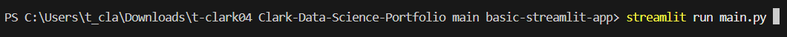

# Palmer's Penguins Streamlit App 🐧 ❄️ 

## Overview 📊
In this my *first* streamlit app, I allow users to filter and explore the Palmer's Penguins dataset, which contains measurements collected on three different species of penguins living on the Palmer Archipelago in Antarctica. 

Upon loading up the app, the user is provided with a metric glossary to help them decide on a variable to explore. They then choose a variable to filter by and play around with the resulting widget to narrow down the data. The filtered dataset is then displayed for them.

With 344 observations and 9 different variables, there's plenty to uncover!

Thanks for checking out my first mini-project!

## Table of Contents

- [Overview]()
- [Getting Started]()
- [Data]()
- [References]()

## Running the App ✅
This application is now deployed on the Streamlit Community Cloud, so there's an easy way and a hard way to run the app.

### The "Easy" Way:
Just click [here](https://clark-penguins.streamlit.app). This link should bring up the published version of the app on the Streamlit website. No further steps necessary -- just select a variable and start exploring! If you wish to see the underlying Python code, however, head over to the "hard" way instead.

### The "Hard" Way:
You'll start by downloading the "basic-streamlit-app" folder from my data science portfolio repository. To do that, first go to [this link](https://download-directory.github.io/). It will open up a page that looks like this:

Paste the following link into the box in the center of the page and hit enter on the keyboard: https://github.com/t-clark04/Clark-Data-Science-Portfolio/tree/main/basic-streamlit-app.

The project files have now been downloaded to your computer as a zip file. Locate the zip file in your Downloads folder, and extract the contents.

Now, open up ``main.py`` in your favorite IDE (mine is VSCode!), head over to the terminal, and use the ls and cd commands to navigate your current directory to the "Clark-Data-Science-Portfolio main basic-streamlit-app" folder on your computer. More specifically, to enter an existing folder in your current working directory, enter "cd folder_name". To exit the folder, enter "cd ..". And to view the contents of your current folder, enter "ls".

Once you're in the correct folder, run the following prompt in the command line:

This will open up the Streamlit app in a new browser window. Happy exploring!

Note: The app.py script uses the following Python libraries: ``streamlit`` (version 1.37.1), ``pandas`` (version 2.2.3), ``seaborn`` (version 0.13.2), ``matplotlib`` (version 3.10.1), ``scikit_learn`` (version 1.6.1), ``plotly`` (version 5.24.1), ``scipy`` (version 1.15.2), and ``pathlib``. If you have never used these libraries before or if they are not contained within your Python Standard Library, you may need to install them before you can run the terminal command. To do so, just hop over to the terminal in your IDE, and type: ``pip install package-name``. For example, to install pandas, just enter ``pip install pandas`` in the terminal and hit enter. Once all of these dependencies are installed, you should be good to go!

The dataframe contains measurements collected between 2007 and 2009 on three different species of penguins living on the Palmer Archipelago in Antarctica. With 344 observations and 9 different variables, there's plenty to uncover!

To check it out, download the files in my repository and open up your Python IDE of choice. Head over to the terminal, and use the ls and cd commands to navigate your current directory to the Clark-Data-Science-Portfolio folder on your computer. For example, to enter an existing folder in your current working directory, enter "cd folder_name". To exit the folder, enter "cd ..". Once you're in the data science portfolio, enter "cd basic-streamlit-app". Then, enter "streamlit run main.py". This will open up the streamlit app in a new browser window. Happy exploring, and thank you for checking out my first streamlit app!

To see the data for yourself, you'll find it in the data folder linked [here](https://github.com/t-clark04/Clark-Data-Science-Portfolio/tree/main/basic-streamlit-app/data). And for more information on the dataset, click [here](https://allisonhorst.github.io/palmerpenguins/articles/intro.html)!
